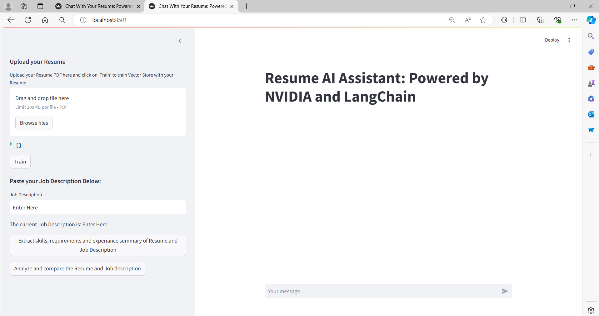

# Resume AI Assistant: Powered by NVIDIA and LangChain for "Generative AI Agents Developer Contest"

# Two Parts of the Project
1. "Chat with your Resume" using Retrieval Augmented Generation (RAG). (This functionality can be used on the right side Streamlit chatbot application)
2. "Comparision of the Resume with Job Description". (This functionality can be used on the left side Side bar of the Streamlit application)

## Table of Contents
1. [Project Aim and the Features](#project-aim-and-the-features)
2. [Tech Stack used](#tech-stack-used)
3. [Project category](#project-category-large-language-model--8b)
4. [Project Setup and Installations](#project-setup-and-installations)
5. [Installation Libraries](#installation-libraries)
6. [Steps of how to use the project](#steps-of-how-to-use-the-project)
7. [Important Note](#important-note)
8. [Usage Example Ideas](#usage-example-ideas)

## Project Aim and the Features
Why and the main aim of the project? 
Many students who are studying the college and schools need to tailor their resume according to the respective job description and even though they have skills they, may not submit the perfect resume version and the "Resume AI Assistant" will help you do so by:
1. Analyzing the summary of the skills and experiences if any you have mentioned in your resume
2. Analyzing the Job description by Summarizing the key skills and other important requirements mentioned in the project.
3. The Resume AI agent will provide a detailed comparison and mention any gaps and/or strong matches.
By this you can overcome any short comings.
Sometimes while filling an intenship application you may need to summarize certain skills or provide a quick intro about yourself in a short paragraph:
4. For that you can use the Resume AI Chatter in the Chatbot part of the application where you can chat with your Resume.
Note:  This feature is implemented using the RAG (retrieval-augmented generation) where your resume is trained and stored in the vector DB FAISS and then you can chat with it.

## Tech Stack used
1. NVIDIA NIMs API catalog
2. NVIDIA connectors within LangChain framework
3. Langchain framework
4. FAISS (Facebook AI Similarity Search) vector database
5. LLM mistralai/mixtral-8x22b-instruct-v0.1
6. Streamlit

## Project category: Large Language Model > 8B

## Project Setup and Installations
1. clone this project to a local folder and insert the Nvidia NIM API by creating from https://www.nvidia.com/en-us/ai/ and by creating a .env folder as mentioned in the example.
Note: I have used mistralai/mixtral-8x22b-instruct-v0.1 Large Language Model.
2. create a virtual environment: I have used conda 
    conda create --name resume_ai_assistant_project
I have used the latest python version i.e., 3.12.4
3. install the requirements from the file requirements.txt file
    pip install -r requirements.txt file
Note: All the versions of the libraries used have been captured in the requirements.txt folder if you get any errors, please refer to the below "Installations of the project" section if you miss any installations.
To capture the local virtual environment use: 
    pip freeze > requirements.txt
4. Now, lastly run the file streamlit_app.py by using the below command
    streamlit run streamlit_app.py
    Open the application and use it according the usage instructions.
Note: I have used windows OS along with the Conda for the virtual environment.

## Installation Libraries
1. pip install langchain
2. pip install langchain-community
3. pip install python-dotenv
4. pip install streamlit
5. pip install langchain_nvidia_ai_endpoints
6. pip install PyPDF2
7. pip install faiss-cpu

## Steps of how to use the project
Part I: RAG Architecture instructions:
1. After starting the Streamlit application you can upload your resume in the file upload section in the PDF format.
2. Hit the Train button and you can also see the chunks in which the Resume is divided into and trained in the Vector Database of FAISS
3. Now, the local RAG Architecture is ready and you can chat with your resume i.e., you can summarize, ask about the details, etc.

Part II: AI Assitant to compare the JOB DESCRIPTION with the Resume to find out the matching criteria:
4. Paste the Job descritption in the Job Description Text box and hit enter.
5. We have two options: 
    1. Extract skills, requirements and experiance: This generates the summary of the skills, requirements and experiance
    2. Analyze and Compare the Resume and Job Description: This will generate the detailed comparison and mention any gaps or strong matches.
6.  We can see the content of the Summary in the sidebar section
7. The Analyzation and the comparision part is added in the chat section.

### Important Note
In the 2nd Feature "Analyze and Compare the Resume and Job Description" is dependent upon the "Extract skills, requirements and experiance" section so click both the buttons in order.

## Usage Example Ideas
1. Helps you tailor your resume according to the job description by getting a detailed comparison and mentioning any gaps or strong matches.
2. You can also use the chatbot functionality in the project to chat with your Resume document and create summaries of required skills, create a summary about yourself in less number of words to fill out a job application!

